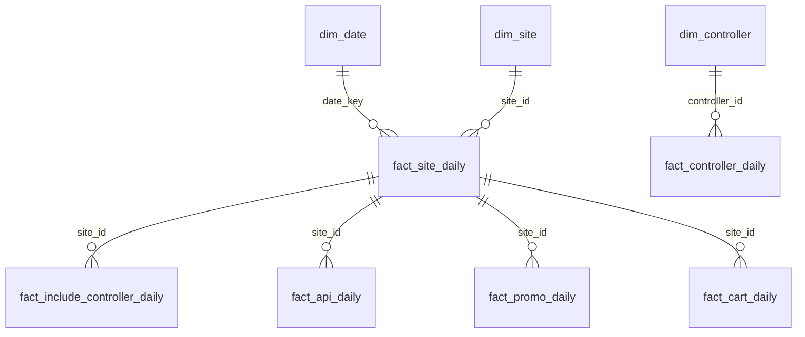

# Modèle de données (aperçu)

## Schéma étoile (extrait)

Tables cibles exposées (Power BI):
- dim_date, dim_site, dim_controller
- fact_controller_daily, fact_site_daily
- fact_include_controller_daily, fact_include_cache_daily
- fact_api_daily, fact_api_resource_daily
- fact_promo_daily, fact_cart_daily, fact_checkout_daily
- fact_promo_perf, fact_best_practices_score

Sources brutes (CCDW SFCC) exploitées:
- ccdw_dim_site_aaqp_prd
- ccdw_aggr_controller_request_aaqp_prd
- ccdw_aggr_include_controller_request_aaqp_prd
- ccdw_aggr_scapi_request_aaqp_prd
- ccdw_aggr_ocapi_request_aaqp_prd
- ccdw_aggr_promotion_activation_aaqp_prd
- ccdw_fact_promotion_line_item_aaqp_prd

Notes:
- Le fichier `perf_dataset/etl/build_perf_dataset.py` décrit la logique d’agrégation (référentiel). Les équipes Data peuvent s’en inspirer si des agrégations DWH sont nécessaires à terme.
- Pour les extractions brutes demandées par l’équipe Data: voir `Raw_Extractions_SQL.md` et `extractions_raw.sql`.

